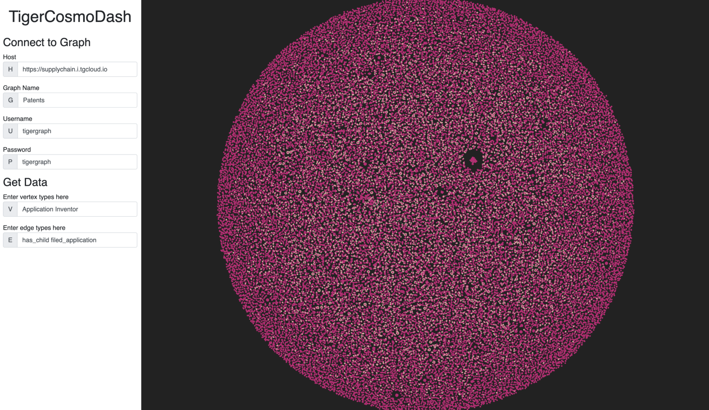

# Cosmos Bootstrap Dashboard

## Quickstart

1. Clone this repository
1. `npm install` to install the dependencies
1. `npx parcel index.html --open` to run the file!

## Demo

Connect to your solution and visualize your graph data!

